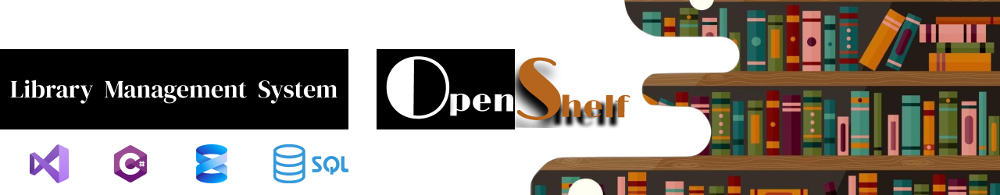

# 📚 OpenShelf – Library Management System (LMS)

OpenShelf is a **smart, database-driven Library Management System** built using **C# (.NET Framework)** and **Microsoft SQL Server**.  
It provides an efficient solution for managing books, members, and library operations  designed for **security**, **accuracy**, and **ease of use**.

---

## 🚀 Key Features

✨ **Unique ID System**  
- **AdminID** – Secure admin login and activity tracking  
- **MemberID** – Automatic generation for each member  
- **BookID / LibraryID** – Unique identifiers for books and library branches  

👥 **User & Role Management**  
- Role-based access for **Admin**, **Librarian**, and **Member**  
- Admin controls system settings, manages users, and monitors operations  
- Members can view available books, request issues, and track their transactions  

📚 **Book Management**  
- Add, update, delete, and search books  
- Categorize by author, genre, or availability  
- Real-time availability tracking  

📊 **Transaction Management**  
- Record **issues, returns, renewals**, and fines  
- Auto-updates book availability  
- Maintains a complete audit log  

📅 **Due Date Alerts & Fine Calculation**  
- Automated overdue detection  
- Fine calculation and reminders  

🔐 **Secure Authentication System**  
- Encrypted login system with **AdminID-based authentication**  
- Role-based permissions and secure password storage  

🧾 **Reports & Analytics**  
- Generate detailed reports for books, members, and transactions  
- Export reports for analysis  

⚙️ **System Settings & Control**  
- Customize settings, credentials, and themes  
- Admin can safely stop the system using “Exit Application” control  

---

## 🧠 Architecture & Design Patterns

- 🏗️ **Layered Architecture** – Presentation, business logic, and data layers separated  
- 🧩 **Singleton Pattern** – Centralized database connection instance  
- 🔄 **Observer Pattern** – Real-time updates for UI components  
- 🏭 **Factory Pattern** – Dynamic object creation for books and users  

---

## 💻 Tech Stack

| Component | Technology |
|-----------|------------|
| **Frontend** | C# Windows Forms (.NET Framework) |
| **Backend** | ADO.NET, Stored Procedures, SQL Queries |
| **Database** | Microsoft SQL Server 2019 |
| **IDE** | Visual Studio 2022 |
| **UI Design** | Modern Windows Forms, custom controls, styled components |
| **Security** | Role-based Access, Data Validation, Exception Handling |

---

## 🧰 Modules Overview

1. **Admin Module** – Full control of system, users, and settings  
2. **Member Module** – Borrow, track, and manage personal transactions  
3. **Book Module** – Inventory management with categories and availability  
4. **Transaction Module** – Issue, return, renewal, and fine processing  
5. **Reports Module** – Generate and export detailed analytics  
6. **Settings Module** – Configure system preferences and exit safely  

---

## 🤝 Contributing

Contributions are **welcome and appreciated**! 🎉  
If you’d like to improve OpenShelf, please follow these steps:

1. Fork the repository  
2. Create a new branch (`feature/your-feature-name`)  
3. Commit your changes with clear messages  
4. Push to your fork  
5. Open a Pull Request  

Please ensure your code follows best practices and is well-documented.

---

## ⭐ Support the Project

If you find **OpenShelf** helpful or useful, please consider **giving this repository a star ⭐**.  
Your support motivates us to continue improving the project and adding new features!

---

## 🔗 Links
- **LinkedIn Article:** _(article link here)_

---

## 👤 Contributors
- [@pathumzcode](https://github.com/pathumzcode) – Pathum Lakshan Bandara  
- [@Kavindu1255](https://github.com/Kavindu1255) - Kavindu Sathsara
- [@Rasindu198](https://github.com/Rasindu198) - Rasindu Gimhan

---

## 📄 License
This project is open-source and available under the **MIT License**.